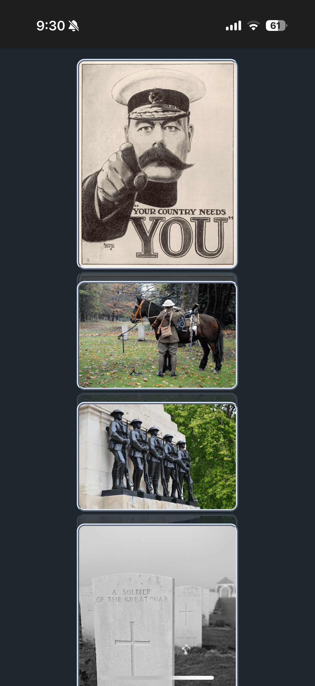
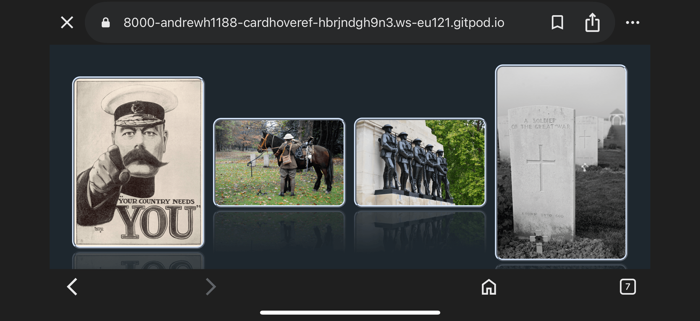
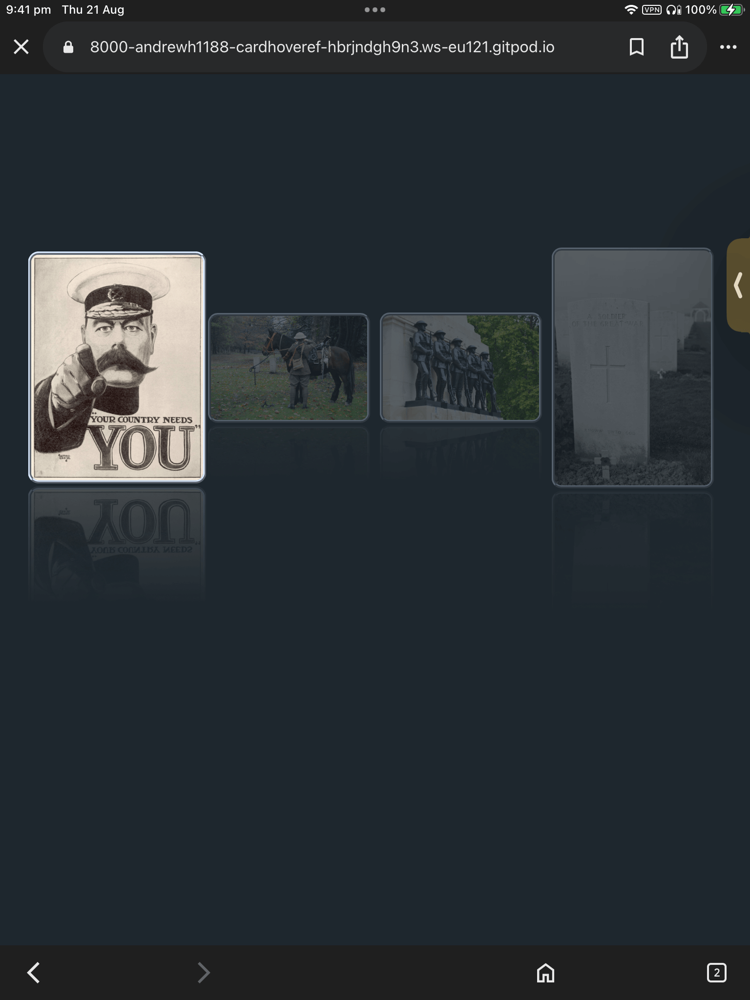
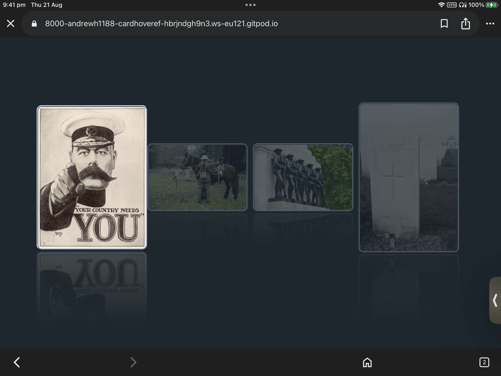
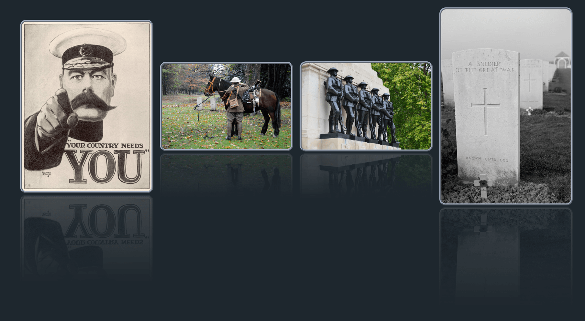

# Card Not On Hover Effect

This project shows 4 cards, that on hover fade the other cards, but increase the size of the hovered card slightly.

If you would like to view the live project please click [here](https://andrewh1188.github.io/Card-Hover-Effect/)

### Showcase and Testing

#### Mobile Portrait

#### Mobile Landscape

#### Tablet Portrait

#### Tablet Portrait - Hover

#### Tablet Landscape

#### Tablet Landscape - Hover

#### Desktop

#### Desktop - Hover
